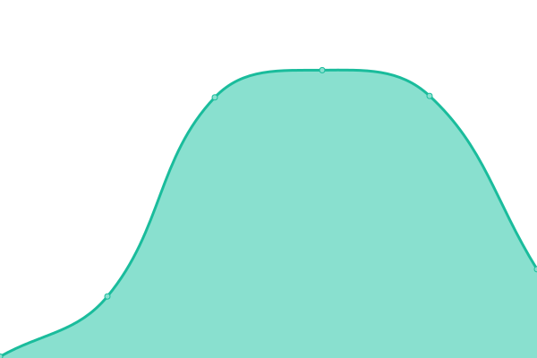

# [📈 Live Status](https://xiotzsupport.github.io/xIoTz-Uptime): <!--live status--> **🟧 Partial outage**

This repository contains the open-source uptime monitor and status page for [xiotzsupport](https://xiotzsupport.github.io/xIoTz-Uptime), powered by [Upptime](https://github.com/upptime/upptime).

With [Upptime](https://upptime.js.org), you can get your own unlimited and free uptime monitor and status page, powered entirely by a GitHub repository. We use [Issues](https://github.com/xiotzsupport/xIoTz-Uptime/issues) as incident reports, [Actions](https://github.com/xiotzsupport/xIoTz-Uptime/actions) as uptime monitors, and [Pages](https://xiotzsupport.github.io/xIoTz-Uptime) for the status page.

<!--start: status pages-->
<!-- This summary is generated by Upptime (https://github.com/upptime/upptime) -->
<!-- Do not edit this manually, your changes will be overwritten -->
<!-- prettier-ignore -->
| URL | Status | History | Response Time | Uptime |
| --- | ------ | ------- | ------------- | ------ |
|  [01_India_MilanLabs](https://milan.xiotz.com/) | 🟥 Down | [01-india-milan-labs.yml](https://github.com/xiotzsupport/xIoTz-Uptime/commits/HEAD/history/01-india-milan-labs.yml) | 

 0ms
     
 | 

<a href="https://xiotzsupport.github.io/xIoTz-Uptime/history/01-india-milan-labs">0.73%</a>
    

|  [02_India_CyberAudit](https://cyberaudit.xiotz.com/) | 🟩 Up | [02-india-cyber-audit.yml](https://github.com/xiotzsupport/xIoTz-Uptime/commits/HEAD/history/02-india-cyber-audit.yml) | 

 1267ms
     
 | 

<a href="https://xiotzsupport.github.io/xIoTz-Uptime/history/02-india-cyber-audit">100.00%</a>
    

|  [04_India_Jesons](https://xoc-jesonsxoc.xiotz.com/) | 🟩 Up | [04-india-jesons.yml](https://github.com/xiotzsupport/xIoTz-Uptime/commits/HEAD/history/04-india-jesons.yml) | 

 1827ms
     
 | 

<a href="https://xiotzsupport.github.io/xIoTz-Uptime/history/04-india-jesons">100.00%</a>
    

|  [05_India_TDAC](https://tdac.xiotz.com/) | 🟩 Up | [05-india-tdac.yml](https://github.com/xiotzsupport/xIoTz-Uptime/commits/HEAD/history/05-india-tdac.yml) | 

 1486ms
     
 | 

<a href="https://xiotzsupport.github.io/xIoTz-Uptime/history/05-india-tdac">100.00%</a>
    

|  [06_India_SISN](https://sisn.xiotz.com/) | 🟥 Down | [06-india-sisn.yml](https://github.com/xiotzsupport/xIoTz-Uptime/commits/HEAD/history/06-india-sisn.yml) | 

 19429ms
     
 | 

<a href="https://xiotzsupport.github.io/xIoTz-Uptime/history/06-india-sisn">26.79%</a>
    

|  [07_India_OneXtel_OP](https://onextel.xiotz.com/) | 🟩 Up | [07-india-one-xtel-op.yml](https://github.com/xiotzsupport/xIoTz-Uptime/commits/HEAD/history/07-india-one-xtel-op.yml) | 

 1473ms
     
 | 

<a href="https://xiotzsupport.github.io/xIoTz-Uptime/history/07-india-one-xtel-op">100.00%</a>
    

|  [08_India_OneXtel_NSE](https://onextelnse.xiotz.com/) | 🟩 Up | [08-india-one-xtel-nse.yml](https://github.com/xiotzsupport/xIoTz-Uptime/commits/HEAD/history/08-india-one-xtel-nse.yml) | 

 1745ms
     
 | 

<a href="https://xiotzsupport.github.io/xIoTz-Uptime/history/08-india-one-xtel-nse">100.00%</a>
    

|  [09_India_OneXtel_DC](https://onextelserver.xiotz.com/) | 🟩 Up | [09-india-one-xtel-dc.yml](https://github.com/xiotzsupport/xIoTz-Uptime/commits/HEAD/history/09-india-one-xtel-dc.yml) | 

 1497ms
     
 | 

<a href="https://xiotzsupport.github.io/xIoTz-Uptime/history/09-india-one-xtel-dc">100.00%</a>
    

|  [10_India_SyrmaSGS](https://syrmasgs.xiotz.com/) | 🟥 Down | [10-india-syrma-sgs.yml](https://github.com/xiotzsupport/xIoTz-Uptime/commits/HEAD/history/10-india-syrma-sgs.yml) | 

 0ms
     
 | 

<a href="https://xiotzsupport.github.io/xIoTz-Uptime/history/10-india-syrma-sgs">58.65%</a>
    

|  [11_UAE_Medseven](https://medseven.xiotz.com/) | 🟥 Down | [11-uae-medseven.yml](https://github.com/xiotzsupport/xIoTz-Uptime/commits/HEAD/history/11-uae-medseven.yml) | 

 2784ms
     
 | 

<a href="https://xiotzsupport.github.io/xIoTz-Uptime/history/11-uae-medseven">14.53%</a>
    

|  [12_UAE_Cicon](https://xoc-cicon.xiotz.com/) | 🟩 Up | [12-uae-cicon.yml](https://github.com/xiotzsupport/xIoTz-Uptime/commits/HEAD/history/12-uae-cicon.yml) | 

 1583ms
     
 | 

<a href="https://xiotzsupport.github.io/xIoTz-Uptime/history/12-uae-cicon">100.00%</a>
    

|  [13_UAE_ALOmeria](https://xoc-alomeria.xiotz.com/) | 🟩 Up | [13-uae-al-omeria.yml](https://github.com/xiotzsupport/xIoTz-Uptime/commits/HEAD/history/13-uae-al-omeria.yml) | 

 1480ms
     
 | 

<a href="https://xiotzsupport.github.io/xIoTz-Uptime/history/13-uae-al-omeria">100.00%</a>
    

|  [14_UAE_AlphaSeven](https://alphaseven.xiotz.com/) | 🟩 Up | [14-uae-alpha-seven.yml](https://github.com/xiotzsupport/xIoTz-Uptime/commits/HEAD/history/14-uae-alpha-seven.yml) | 

 1486ms
     
 | 

<a href="https://xiotzsupport.github.io/xIoTz-Uptime/history/14-uae-alpha-seven">100.00%</a>
    

|  [15_UAE_Gemini](https://xoc-geminiuae.xiotz.com/) | 🟩 Up | [15-uae-gemini.yml](https://github.com/xiotzsupport/xIoTz-Uptime/commits/HEAD/history/15-uae-gemini.yml) | 

 1637ms
     
 | 

<a href="https://xiotzsupport.github.io/xIoTz-Uptime/history/15-uae-gemini">100.00%</a>
    

|  [16_UAE_Bell](https://xoc-bell.xiotz.com/) | 🟩 Up | [16-uae-bell.yml](https://github.com/xiotzsupport/xIoTz-Uptime/commits/HEAD/history/16-uae-bell.yml) | 

 1608ms
     
 | 

<a href="https://xiotzsupport.github.io/xIoTz-Uptime/history/16-uae-bell">100.00%</a>
    

|  [21_Australia_CornellDieselSystems](https://cornell.xiotz.com/) | 🟩 Up | [21-australia-cornell-diesel-systems.yml](https://github.com/xiotzsupport/xIoTz-Uptime/commits/HEAD/history/21-australia-cornell-diesel-systems.yml) | 

 1239ms
     
 | 

<a href="https://xiotzsupport.github.io/xIoTz-Uptime/history/21-australia-cornell-diesel-systems">100.00%</a>
    

|  [22_Australia_MTQ-Cornell](https://mtq.xiotz.com/) | 🟩 Up | [22-australia-mtq-cornell.yml](https://github.com/xiotzsupport/xIoTz-Uptime/commits/HEAD/history/22-australia-mtq-cornell.yml) | 

 1224ms
     
 | 

<a href="https://xiotzsupport.github.io/xIoTz-Uptime/history/22-australia-mtq-cornell">100.00%</a>
    

|  [23_Australia_CDMLogistics](https://cdmlogistics.xiotz.com/) | 🟩 Up | [23-australia-cdm-logistics.yml](https://github.com/xiotzsupport/xIoTz-Uptime/commits/HEAD/history/23-australia-cdm-logistics.yml) | 

 1183ms
     
 | 

<a href="https://xiotzsupport.github.io/xIoTz-Uptime/history/23-australia-cdm-logistics">100.00%</a>
    

|  [24_Australia_PrimaryComms](https://primarycomms.xiotz.com/) | 🟩 Up | [24-australia-primary-comms.yml](https://github.com/xiotzsupport/xIoTz-Uptime/commits/HEAD/history/24-australia-primary-comms.yml) | 

 1142ms
     
 | 

<a href="https://xiotzsupport.github.io/xIoTz-Uptime/history/24-australia-primary-comms">100.00%</a>
    

|  [25_Australia_NIA](https://nia.xiotz.com/) | 🟩 Up | [25-australia-nia.yml](https://github.com/xiotzsupport/xIoTz-Uptime/commits/HEAD/history/25-australia-nia.yml) | 

 1148ms
     
 | 

<a href="https://xiotzsupport.github.io/xIoTz-Uptime/history/25-australia-nia">100.00%</a>
    

|  [26_Australia_Thomax](https://thomaxxoc.xiotz.com/) | 🟩 Up | [26-australia-thomax.yml](https://github.com/xiotzsupport/xIoTz-Uptime/commits/HEAD/history/26-australia-thomax.yml) | 

 1115ms
     
 | 

<a href="https://xiotzsupport.github.io/xIoTz-Uptime/history/26-australia-thomax">100.00%</a>
    

|  [27_Australia_ICT](https://ict.xiotz.com/) | 🟩 Up | [27-australia-ict.yml](https://github.com/xiotzsupport/xIoTz-Uptime/commits/HEAD/history/27-australia-ict.yml) | 

 1262ms
     
 | 

<a href="https://xiotzsupport.github.io/xIoTz-Uptime/history/27-australia-ict">100.00%</a>
    

|  [31_India_Dovetail](https://dovetail.xiotz.com/) | 🟩 Up | [31-india-dovetail.yml](https://github.com/xiotzsupport/xIoTz-Uptime/commits/HEAD/history/31-india-dovetail.yml) | 

 1476ms
     
 | 

<a href="https://xiotzsupport.github.io/xIoTz-Uptime/history/31-india-dovetail">100.00%</a>
    

|  [32_India_Himedia](https://xoc-himedia.xiotz.com/) | 🟥 Down | [32-india-himedia.yml](https://github.com/xiotzsupport/xIoTz-Uptime/commits/HEAD/history/32-india-himedia.yml) | 

 74ms
     
 | 

<a href="https://xiotzsupport.github.io/xIoTz-Uptime/history/32-india-himedia">0.00%</a>
    

|  [33_India_JLMorison](https://xoc-jlmorisonxoc.xiotz.com/) | 🟥 Down | [33-india-jl-morison.yml](https://github.com/xiotzsupport/xIoTz-Uptime/commits/HEAD/history/33-india-jl-morison.yml) | 

 59ms
     
 | 

<a href="https://xiotzsupport.github.io/xIoTz-Uptime/history/33-india-jl-morison">0.00%</a>
    

|  [34_xIoTz_India_Unishield](https://unishield.xiotz.com/) | 🟩 Up | [34-x-io-tz-india-unishield.yml](https://github.com/xiotzsupport/xIoTz-Uptime/commits/HEAD/history/34-x-io-tz-india-unishield.yml) | 

 1516ms
     
 | 

<a href="https://xiotzsupport.github.io/xIoTz-Uptime/history/34-x-io-tz-india-unishield">100.00%</a>
    

|  [35_India_UnishieldCx](https://unishieldcx.xiotz.com/) | 🟩 Up | [35-india-unishield-cx.yml](https://github.com/xiotzsupport/xIoTz-Uptime/commits/HEAD/history/35-india-unishield-cx.yml) | 

 1463ms
     
 | 

<a href="https://xiotzsupport.github.io/xIoTz-Uptime/history/35-india-unishield-cx">100.00%</a>
    

|  [36_India_Indevia](https://indeviaucap.xiotz.com/) | 🟩 Up | [36-india-indevia.yml](https://github.com/xiotzsupport/xIoTz-Uptime/commits/HEAD/history/36-india-indevia.yml) | 

 1279ms
     
 | 

<a href="https://xiotzsupport.github.io/xIoTz-Uptime/history/36-india-indevia">100.00%</a>
    

|  [41_Tanzania_FlashNet](https://flashnet.xiotz.com/) | 🟩 Up | [41-tanzania-flash-net.yml](https://github.com/xiotzsupport/xIoTz-Uptime/commits/HEAD/history/41-tanzania-flash-net.yml) | 

 1399ms
     
 | 

<a href="https://xiotzsupport.github.io/xIoTz-Uptime/history/41-tanzania-flash-net">100.00%</a>
    

|  [Google](https://www.google.com) | 🟩 Up | [google.yml](https://github.com/xiotzsupport/xIoTz-Uptime/commits/HEAD/history/google.yml) | 

 112ms
     
 | 

<a href="https://xiotzsupport.github.io/xIoTz-Uptime/history/google">100.00%</a>
    

|  [Wikipedia](https://en.wikipedia.org) | 🟩 Up | [wikipedia.yml](https://github.com/xiotzsupport/xIoTz-Uptime/commits/HEAD/history/wikipedia.yml) | 

 152ms
     
 | 

<a href="https://xiotzsupport.github.io/xIoTz-Uptime/history/wikipedia">100.00%</a>
    

|  [Hacker News](https://news.ycombinator.com) | 🟩 Up | [hacker-news.yml](https://github.com/xiotzsupport/xIoTz-Uptime/commits/HEAD/history/hacker-news.yml) | 

 285ms
     
 | 

<a href="https://xiotzsupport.github.io/xIoTz-Uptime/history/hacker-news">100.00%</a>
    

|  [Test Broken Site](https://thissitedoesnotexist.koj.co) | 🟥 Down | [test-broken-site.yml](https://github.com/xiotzsupport/xIoTz-Uptime/commits/HEAD/history/test-broken-site.yml) | 

 0ms
     
 | 

<a href="https://xiotzsupport.github.io/xIoTz-Uptime/history/test-broken-site">100.00%</a>
    

|  [IPv6 test](forwardemail.net) | 🟩 Up | [i-pv6-test.yml](https://github.com/xiotzsupport/xIoTz-Uptime/commits/HEAD/history/i-pv6-test.yml) | 

 51ms
     
 | 

<a href="https://xiotzsupport.github.io/xIoTz-Uptime/history/i-pv6-test">100.00%</a>
    

<!--end: status pages-->

[**Visit our status website →**](https://xiotzsupport.github.io/xIoTz-Uptime)

## 📄 License

- Powered by: [Upptime](https://github.com/upptime/upptime)
- Code: [MIT](./LICENSE) © [Anand Chowdhary](https://anandchowdhary.com), supported by [Pabio](https://pabio.com)
- Data in the `./history` directory: [Open Database License](https://opendatacommons.org/licenses/odbl/1-0/)
