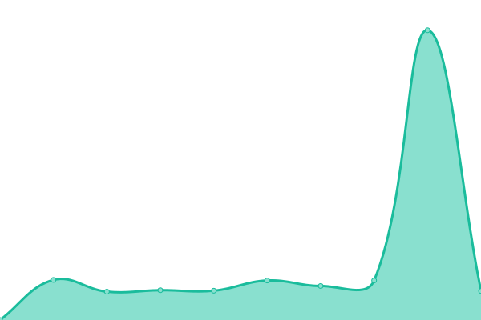
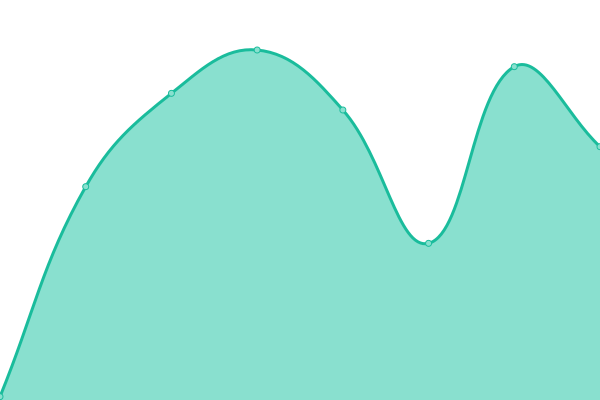
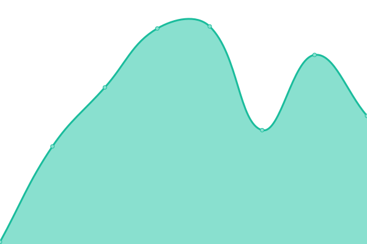
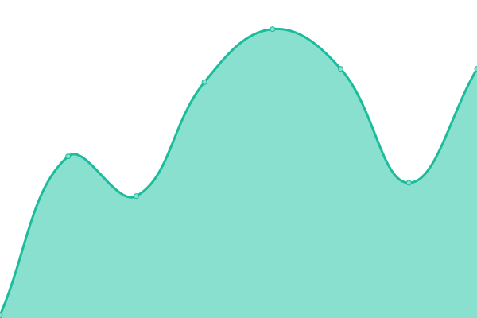
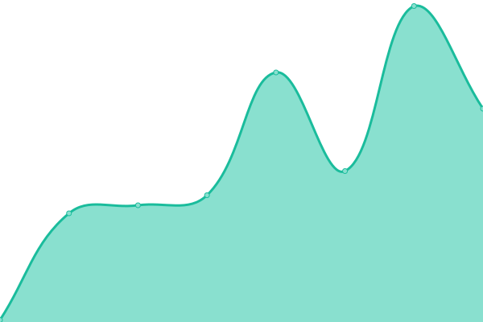

# [📈 Live Status](https://xiotzsupport.github.io/xIoTz-Uptime): <!--live status--> **🟧 Partial outage**

This repository contains the open-source uptime monitor and status page for [xiotzsupport](https://xiotzsupport.github.io/xIoTz-Uptime), powered by [Upptime](https://github.com/upptime/upptime).

With [Upptime](https://upptime.js.org), you can get your own unlimited and free uptime monitor and status page, powered entirely by a GitHub repository. We use [Issues](https://github.com/xiotzsupport/xIoTz-Uptime/issues) as incident reports, [Actions](https://github.com/xiotzsupport/xIoTz-Uptime/actions) as uptime monitors, and [Pages](https://xiotzsupport.github.io/xIoTz-Uptime) for the status page.

<!--start: status pages-->
<!-- This summary is generated by Upptime (https://github.com/upptime/upptime) -->
<!-- Do not edit this manually, your changes will be overwritten -->
<!-- prettier-ignore -->
| URL | Status | History | Response Time | Uptime |
| --- | ------ | ------- | ------------- | ------ |
|  [000_Uptime_FreshPing](https://statuspage.freshping.io/69684-xIoTzUCAP) | 🟩 Up | [000-uptime-fresh-ping.yml](https://github.com/xiotzsupport/xIoTz-Uptime/commits/HEAD/history/000-uptime-fresh-ping.yml) | 

 1381ms
     
 | 

<a href="https://Status-UCAP.xiotz.com/history/000-uptime-fresh-ping">100.00%</a>
    

|  [000_Uptime_xIoTzUCAP](https://github.com/xiotzsupport/xIoTz-Uptime) | 🟩 Up | [000-uptime-x-io-tz-ucap.yml](https://github.com/xiotzsupport/xIoTz-Uptime/commits/HEAD/history/000-uptime-x-io-tz-ucap.yml) | 

 668ms
     
 | 

<a href="https://Status-UCAP.xiotz.com/history/000-uptime-x-io-tz-ucap">100.00%</a>
    

|  [000_Uptime_xIoTzCX](https://github.com/xiotzsupport/xIoTzcs-Uptime) | 🟩 Up | [000-uptime-x-io-tz-cx.yml](https://github.com/xiotzsupport/xIoTz-Uptime/commits/HEAD/history/000-uptime-x-io-tz-cx.yml) | 

 521ms
     
 | 

<a href="https://Status-UCAP.xiotz.com/history/000-uptime-x-io-tz-cx">100.00%</a>
    

|  [0012_UCAP_India_MilanLabs](https://milanlabs-endpoint.xiotz.com/app/login?) | 🟥 Down | [0012-ucap-india-milan-labs.yml](https://github.com/xiotzsupport/xIoTz-Uptime/commits/HEAD/history/0012-ucap-india-milan-labs.yml) | 

 0ms
     
 | 

<a href="https://Status-UCAP.xiotz.com/history/0012-ucap-india-milan-labs">0.00%</a>
    

|  [9901_UCAP_India_Internal_CyberAudit](https://cyberaudit-endpoint.xiotz.com/app/login?) | 🟥 Down | [9901-ucap-india-internal-cyber-audit.yml](https://github.com/xiotzsupport/xIoTz-Uptime/commits/HEAD/history/9901-ucap-india-internal-cyber-audit.yml) | 

 0ms
     
 | 

<a href="https://Status-UCAP.xiotz.com/history/9901-ucap-india-internal-cyber-audit">0.00%</a>
    

|  [9902_UCAP_India_Internal_Zenalyst](https://zenalystai-endpoint.xiotz.com/app/login?) | 🟥 Down | [9902-ucap-india-internal-zenalyst.yml](https://github.com/xiotzsupport/xIoTz-Uptime/commits/HEAD/history/9902-ucap-india-internal-zenalyst.yml) | 

 0ms
     
 | 

<a href="https://Status-UCAP.xiotz.com/history/9902-ucap-india-internal-zenalyst">0.00%</a>
    

|  [9903_UCAP_India_Internal_XAR](https://xar-endpoint.xiotz.com/app/login?) | 🟥 Down | [9903-ucap-india-internal-xar.yml](https://github.com/xiotzsupport/xIoTz-Uptime/commits/HEAD/history/9903-ucap-india-internal-xar.yml) | 

 0ms
     
 | 

<a href="https://Status-UCAP.xiotz.com/history/9903-ucap-india-internal-xar">0.00%</a>
    

|  [9904_UCAP_India_Internal_UpgradeAI](https://upgradeai-endpoint.xiotz.com/app/login?) | 🟥 Down | [9904-ucap-india-internal-upgrade-ai.yml](https://github.com/xiotzsupport/xIoTz-Uptime/commits/HEAD/history/9904-ucap-india-internal-upgrade-ai.yml) | 

 0ms
     
 | 

<a href="https://Status-UCAP.xiotz.com/history/9904-ucap-india-internal-upgrade-ai">0.00%</a>
    

|  [0001_UCAP_India_OneXtel_OP](https://onextel-endpoint.xiotz.com/app/login?) | 🟩 Up | [0001-ucap-india-one-xtel-op.yml](https://github.com/xiotzsupport/xIoTz-Uptime/commits/HEAD/history/0001-ucap-india-one-xtel-op.yml) | 

 1291ms
     
 | 

<a href="https://Status-UCAP.xiotz.com/history/0001-ucap-india-one-xtel-op">100.00%</a>
    

|  [0002_UCAP_India_OneXtel_NSE](https://onextelnse-endpoint.xiotz.com/app/login?) | 🟥 Down | [0002-ucap-india-one-xtel-nse.yml](https://github.com/xiotzsupport/xIoTz-Uptime/commits/HEAD/history/0002-ucap-india-one-xtel-nse.yml) | 

 0ms
     
 | 

<a href="https://Status-UCAP.xiotz.com/history/0002-ucap-india-one-xtel-nse">0.00%</a>
    

|  [0003_UCAP_India_OneXtel_DC](https://onextelserver-endpoint.xiotz.com/app/login?) | 🟥 Down | [0003-ucap-india-one-xtel-dc.yml](https://github.com/xiotzsupport/xIoTz-Uptime/commits/HEAD/history/0003-ucap-india-one-xtel-dc.yml) | 

 0ms
     
 | 

<a href="https://Status-UCAP.xiotz.com/history/0003-ucap-india-one-xtel-dc">0.00%</a>
    

|  [0004_UCAP_India_OneXtel_SBI](https://sbionextel-endpoint.xiotz.com/app/login?) | 🟥 Down | [0004-ucap-india-one-xtel-sbi.yml](https://github.com/xiotzsupport/xIoTz-Uptime/commits/HEAD/history/0004-ucap-india-one-xtel-sbi.yml) | 

 0ms
     
 | 

<a href="https://Status-UCAP.xiotz.com/history/0004-ucap-india-one-xtel-sbi">0.00%</a>
    

|  [0006_UCAP_India_OneXtel_WP](https://waonextel-endpoint.xiotz.com/app/login?) | 🟥 Down | [0006-ucap-india-one-xtel-wp.yml](https://github.com/xiotzsupport/xIoTz-Uptime/commits/HEAD/history/0006-ucap-india-one-xtel-wp.yml) | 

 0ms
     
 | 

<a href="https://Status-UCAP.xiotz.com/history/0006-ucap-india-one-xtel-wp">0.00%</a>
    

|  [0007_UCAP_India_ITI-Finance](https://itifinance-endpoint.xiotz.com/app/login?) | 🟥 Down | [0007-ucap-india-iti-finance.yml](https://github.com/xiotzsupport/xIoTz-Uptime/commits/HEAD/history/0007-ucap-india-iti-finance.yml) | 

 0ms
     
 | 

<a href="https://Status-UCAP.xiotz.com/history/0007-ucap-india-iti-finance">0.00%</a>
    

|  [0008_UCAP_India_FourDimensions](https://fourdimensions-endpoint.xiotz.com/app/login?) | 🟥 Down | [0008-ucap-india-four-dimensions.yml](https://github.com/xiotzsupport/xIoTz-Uptime/commits/HEAD/history/0008-ucap-india-four-dimensions.yml) | 

 0ms
     
 | 

<a href="https://Status-UCAP.xiotz.com/history/0008-ucap-india-four-dimensions">0.00%</a>
    

|  [1002_UCAP_UAE_Medseven](https://medseven-endpoint.xiotz.com/app/login?) | 🟩 Up | [1002-ucap-uae-medseven.yml](https://github.com/xiotzsupport/xIoTz-Uptime/commits/HEAD/history/1002-ucap-uae-medseven.yml) | 

 1168ms
     
 | 

<a href="https://Status-UCAP.xiotz.com/history/1002-ucap-uae-medseven">100.00%</a>
    

|  [1004_UCAP_UAE_ALOmeria](https://alomeria-endpoint.xiotz.com/app/login?) | 🟥 Down | [1004-ucap-uae-al-omeria.yml](https://github.com/xiotzsupport/xIoTz-Uptime/commits/HEAD/history/1004-ucap-uae-al-omeria.yml) | 

 0ms
     
 | 

<a href="https://Status-UCAP.xiotz.com/history/1004-ucap-uae-al-omeria">0.00%</a>
    

|  [1005_UCAP_UAE_AlphaSeven](https://alphaseven-endpoint.xiotz.com/app/login?) | 🟥 Down | [1005-ucap-uae-alpha-seven.yml](https://github.com/xiotzsupport/xIoTz-Uptime/commits/HEAD/history/1005-ucap-uae-alpha-seven.yml) | 

 0ms
     
 | 

<a href="https://Status-UCAP.xiotz.com/history/1005-ucap-uae-alpha-seven">0.00%</a>
    

|  [0009_UCAP_India_U360_Dovetail](https://dovetail-endpoint.xiotz.com/app/login?) | 🟥 Down | [0009-ucap-india-u360-dovetail.yml](https://github.com/xiotzsupport/xIoTz-Uptime/commits/HEAD/history/0009-ucap-india-u360-dovetail.yml) | 

 0ms
     
 | 

<a href="https://Status-UCAP.xiotz.com/history/0009-ucap-india-u360-dovetail">0.00%</a>
    

|  [0010_UCAP_India_U360_Himedia](https://himedia-endpoint.xiotz.com/app/login?) | 🟥 Down | [0010-ucap-india-u360-himedia.yml](https://github.com/xiotzsupport/xIoTz-Uptime/commits/HEAD/history/0010-ucap-india-u360-himedia.yml) | 

 0ms
     
 | 

<a href="https://Status-UCAP.xiotz.com/history/0010-ucap-india-u360-himedia">0.00%</a>
    

|  [0011_UCAP_India_U360_JLMorison](https://jlmorison-endpoint.xiotz.com/app/login?) | 🟥 Down | [0011-ucap-india-u360-jl-morison.yml](https://github.com/xiotzsupport/xIoTz-Uptime/commits/HEAD/history/0011-ucap-india-u360-jl-morison.yml) | 

 0ms
     
 | 

<a href="https://Status-UCAP.xiotz.com/history/0011-ucap-india-u360-jl-morison">0.00%</a>
    

|  [3001_UCAP_Tanzania_FlashNet](https://flashnet-endpoint.xiotz.com/app/login?) | 🟩 Up | [3001-ucap-tanzania-flash-net.yml](https://github.com/xiotzsupport/xIoTz-Uptime/commits/HEAD/history/3001-ucap-tanzania-flash-net.yml) | 

 1353ms
     
 | 

<a href="https://Status-UCAP.xiotz.com/history/3001-ucap-tanzania-flash-net">100.00%</a>
    

|  [2001_xIoTz_KSA_AlabeerGroup](https://alabeer-endpoint.xiotz.com/app/login?) | 🟥 Down | [2001-x-io-tz-ksa-alabeer-group.yml](https://github.com/xiotzsupport/xIoTz-Uptime/commits/HEAD/history/2001-x-io-tz-ksa-alabeer-group.yml) | 

 0ms
     
 | 

<a href="https://Status-UCAP.xiotz.com/history/2001-x-io-tz-ksa-alabeer-group">0.00%</a>
    

|  [1008_UAE_Ad_Precast](https://adprecast-endpoint.xiotz.com/app/login?) | 🟩 Up | [1008-uae-ad-precast.yml](https://github.com/xiotzsupport/xIoTz-Uptime/commits/HEAD/history/1008-uae-ad-precast.yml) | 

 1371ms
     
 | 

<a href="https://Status-UCAP.xiotz.com/history/1008-uae-ad-precast">100.00%</a>
    

|  [1006_UAE_PrivateOffice](https://privateoffice-endpoint.xiotz.com/app/login?) | 🟥 Down | [1006-uae-private-office.yml](https://github.com/xiotzsupport/xIoTz-Uptime/commits/HEAD/history/1006-uae-private-office.yml) | 

 0ms
     
 | 

<a href="https://Status-UCAP.xiotz.com/history/1006-uae-private-office">0.01%</a>
    

|  [1001_UAE_ZeeStores](https://zeestores-endpoint.xiotz.com/app/login?) | 🟥 Down | [1001-uae-zee-stores.yml](https://github.com/xiotzsupport/xIoTz-Uptime/commits/HEAD/history/1001-uae-zee-stores.yml) | 

 0ms
     
 | 

<a href="https://Status-UCAP.xiotz.com/history/1001-uae-zee-stores">0.00%</a>
    

|  [1007_UAE_Miaat](https://miaat-endpoint.xiotz.com/app/login?) | 🟥 Down | [1007-uae-miaat.yml](https://github.com/xiotzsupport/xIoTz-Uptime/commits/HEAD/history/1007-uae-miaat.yml) | 

 0ms
     
 | 

<a href="https://Status-UCAP.xiotz.com/history/1007-uae-miaat">0.00%</a>
    

|  [ecloud-ict.xiotz.com](https://ecloud-india-dovetail.xiotz.com/) | 🟥 Down | [ecloud-ict-xiotz-com.yml](https://github.com/xiotzsupport/xIoTz-Uptime/commits/HEAD/history/ecloud-ict-xiotz-com.yml) | 

 62ms
     
 | 

<a href="https://Status-UCAP.xiotz.com/history/ecloud-ict-xiotz-com">47.15%</a>
    

|  [ecloud-india-ho-serverroone.xiotz.com](https://ecloud-india-ho-serverroone.xiotz.com/) | 🟥 Down | [ecloud-india-ho-serverroone-xiotz-com.yml](https://github.com/xiotzsupport/xIoTz-Uptime/commits/HEAD/history/ecloud-india-ho-serverroone-xiotz-com.yml) | 

 66ms
     
 | 

<a href="https://Status-UCAP.xiotz.com/history/ecloud-india-ho-serverroone-xiotz-com">47.15%</a>
    

|  [ecloud-india-ho-serverroprod.xiotz.com](https://ecloud-india-ho-serverroprod.xiotz.com/) | 🟥 Down | [ecloud-india-ho-serverroprod-xiotz-com.yml](https://github.com/xiotzsupport/xIoTz-Uptime/commits/HEAD/history/ecloud-india-ho-serverroprod-xiotz-com.yml) | 

 0ms
     
 | 

<a href="https://Status-UCAP.xiotz.com/history/ecloud-india-ho-serverroprod-xiotz-com">100.00%</a>
    

|  [ecloud-india-ho-serverrothree.xiotz.com](https://ecloud-india-ho-serverrothree.xiotz.com/) | 🟥 Down | [ecloud-india-ho-serverrothree-xiotz-com.yml](https://github.com/xiotzsupport/xIoTz-Uptime/commits/HEAD/history/ecloud-india-ho-serverrothree-xiotz-com.yml) | 

 62ms
     
 | 

<a href="https://Status-UCAP.xiotz.com/history/ecloud-india-ho-serverrothree-xiotz-com">47.15%</a>
    

|  [ecloud-india-ho-serverrotwo.xiotz.com](https://ecloud-india-ho-serverrotwo.xiotz.com/) | 🟥 Down | [ecloud-india-ho-serverrotwo-xiotz-com.yml](https://github.com/xiotzsupport/xIoTz-Uptime/commits/HEAD/history/ecloud-india-ho-serverrotwo-xiotz-com.yml) | 

 64ms
     
 | 

<a href="https://Status-UCAP.xiotz.com/history/ecloud-india-ho-serverrotwo-xiotz-com">47.15%</a>
    

|  [ecloud-india-milan.xiotz.com](https://ecloud-india-milan.xiotz.com/) | 🟥 Down | [ecloud-india-milan-xiotz-com.yml](https://github.com/xiotzsupport/xIoTz-Uptime/commits/HEAD/history/ecloud-india-milan-xiotz-com.yml) | 

 62ms
     
 | 

<a href="https://Status-UCAP.xiotz.com/history/ecloud-india-milan-xiotz-com">47.15%</a>
    

|  [ecloud-india-rd-alphard.xiotz.com](https://ecloud-india-rd-alphard.xiotz.com/) | 🟥 Down | [ecloud-india-rd-alphard-xiotz-com.yml](https://github.com/xiotzsupport/xIoTz-Uptime/commits/HEAD/history/ecloud-india-rd-alphard-xiotz-com.yml) | 

 62ms
     
 | 

<a href="https://Status-UCAP.xiotz.com/history/ecloud-india-rd-alphard-xiotz-com">47.15%</a>
    

|  [ecloud-india-rd-betard.xiotz.com](https://ecloud-india-rd-betard.xiotz.com/) | 🟥 Down | [ecloud-india-rd-betard-xiotz-com.yml](https://github.com/xiotzsupport/xIoTz-Uptime/commits/HEAD/history/ecloud-india-rd-betard-xiotz-com.yml) | 

 63ms
     
 | 

<a href="https://Status-UCAP.xiotz.com/history/ecloud-india-rd-betard-xiotz-com">47.15%</a>
    

|  [ecloud-india-rd-deltard.xiotz.com](https://ecloud-india-rd-deltard.xiotz.com/) | 🟥 Down | [ecloud-india-rd-deltard-xiotz-com.yml](https://github.com/xiotzsupport/xIoTz-Uptime/commits/HEAD/history/ecloud-india-rd-deltard-xiotz-com.yml) | 

 60ms
     
 | 

<a href="https://Status-UCAP.xiotz.com/history/ecloud-india-rd-deltard-xiotz-com">47.16%</a>
    

|  [ecloud-india-rd-sigmard.xiotz.com](https://ecloud-india-rd-sigmard.xiotz.com/) | 🟥 Down | [ecloud-india-rd-sigmard-xiotz-com.yml](https://github.com/xiotzsupport/xIoTz-Uptime/commits/HEAD/history/ecloud-india-rd-sigmard-xiotz-com.yml) | 

 64ms
     
 | 

<a href="https://Status-UCAP.xiotz.com/history/ecloud-india-rd-sigmard-xiotz-com">47.16%</a>
    

|  [ecloud-uae-alomeira.xiotz.com](https://ecloud-uae-alomeira.xiotz.com/) | 🟥 Down | [ecloud-uae-alomeira-xiotz-com.yml](https://github.com/xiotzsupport/xIoTz-Uptime/commits/HEAD/history/ecloud-uae-alomeira-xiotz-com.yml) | 

 61ms
     
 | 

<a href="https://Status-UCAP.xiotz.com/history/ecloud-uae-alomeira-xiotz-com">47.16%</a>
    

|  [ecloud-uae-alpha7.xiotz.com](https://ecloud-uae-alpha7.xiotz.com/) | 🟥 Down | [ecloud-uae-alpha7-xiotz-com.yml](https://github.com/xiotzsupport/xIoTz-Uptime/commits/HEAD/history/ecloud-uae-alpha7-xiotz-com.yml) | 

 62ms
     
 | 

<a href="https://Status-UCAP.xiotz.com/history/ecloud-uae-alpha7-xiotz-com">47.16%</a>
    

|  [ecloud-uae-medseven.xiotz.com](https://ecloud-uae-medseven.xiotz.com/) | 🟥 Down | [ecloud-uae-medseven-xiotz-com.yml](https://github.com/xiotzsupport/xIoTz-Uptime/commits/HEAD/history/ecloud-uae-medseven-xiotz-com.yml) | 

 62ms
     
 | 

<a href="https://Status-UCAP.xiotz.com/history/ecloud-uae-medseven-xiotz-com">47.16%</a>
    

<!--end: status pages-->

[**Visit our status website →**](https://xiotzsupport.github.io/xIoTz-Uptime)

## 📄 License

- Powered by: [Upptime](https://github.com/upptime/upptime)
- Code: [MIT](./LICENSE) © [Anand Chowdhary](https://anandchowdhary.com), supported by [Pabio](https://pabio.com)
- Data in the `./history` directory: [Open Database License](https://opendatacommons.org/licenses/odbl/1-0/)
