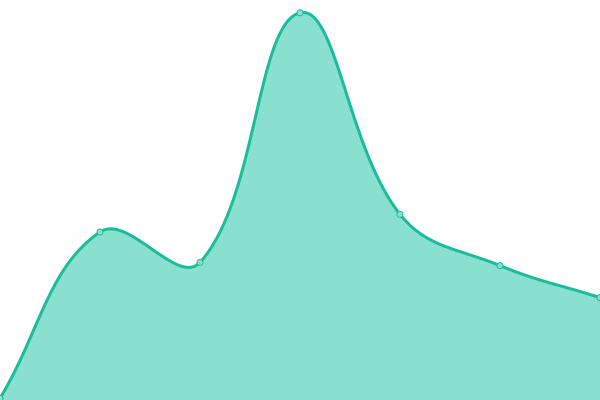

# [📈 Live Status](https://xiotzsupport.github.io/xIoTz-Uptime): <!--live status--> **🟧 Partial outage**

This repository contains the open-source uptime monitor and status page for [xiotzsupport](https://xiotzsupport.github.io/xIoTz-Uptime), powered by [Upptime](https://github.com/upptime/upptime).

With [Upptime](https://upptime.js.org), you can get your own unlimited and free uptime monitor and status page, powered entirely by a GitHub repository. We use [Issues](https://github.com/xiotzsupport/xIoTz-Uptime/issues) as incident reports, [Actions](https://github.com/xiotzsupport/xIoTz-Uptime/actions) as uptime monitors, and [Pages](https://xiotzsupport.github.io/xIoTz-Uptime) for the status page.

<!--start: status pages-->
<!-- This summary is generated by Upptime (https://github.com/upptime/upptime) -->
<!-- Do not edit this manually, your changes will be overwritten -->
<!-- prettier-ignore -->
| URL | Status | History | Response Time | Uptime |
| --- | ------ | ------- | ------------- | ------ |
|  [00_Uptime_Dashboards](https://dashboards.xiotz.com/) | 🟥 Down | [00-uptime-dashboards.yml](https://github.com/xiotzsupport/xIoTz-Uptime/commits/HEAD/history/00-uptime-dashboards.yml) | 

 5498ms
     
 | 

<a href="https://Status-UCAP.xiotz.com/history/00-uptime-dashboards">94.99%</a>
    

|  [00_Uptime_FreshPing](https://statuspage.freshping.io/69684-xIoTzUCAP) | 🟩 Up | [00-uptime-fresh-ping.yml](https://github.com/xiotzsupport/xIoTz-Uptime/commits/HEAD/history/00-uptime-fresh-ping.yml) | 

 1527ms
     
 | 

<a href="https://Status-UCAP.xiotz.com/history/00-uptime-fresh-ping">99.80%</a>
    

|  [00_Uptime_xIoTzUCAP](https://status-ucap.xiotz.com/) | 🟩 Up | [00-uptime-x-io-tz-ucap.yml](https://github.com/xiotzsupport/xIoTz-Uptime/commits/HEAD/history/00-uptime-x-io-tz-ucap.yml) | 

 194ms
     
 | 

<a href="https://Status-UCAP.xiotz.com/history/00-uptime-x-io-tz-ucap">100.00%</a>
    

|  [00_Uptime_xIoTzCX](https://status-cx.xiotz.com/) | 🟩 Up | [00-uptime-x-io-tz-cx.yml](https://github.com/xiotzsupport/xIoTz-Uptime/commits/HEAD/history/00-uptime-x-io-tz-cx.yml) | 

 189ms
     
 | 

<a href="https://Status-UCAP.xiotz.com/history/00-uptime-x-io-tz-cx">100.00%</a>
    

|  [01_UCAP_India_MilanLabs](https://milanlabs.xiotz.com/) | 🟩 Up | [01-ucap-india-milan-labs.yml](https://github.com/xiotzsupport/xIoTz-Uptime/commits/HEAD/history/01-ucap-india-milan-labs.yml) | 

 1399ms
     
 | 

<a href="https://Status-UCAP.xiotz.com/history/01-ucap-india-milan-labs">100.00%</a>
    

|  [02_UCAP_India_CyberAudit](https://cyberaudit.xiotz.com/) | 🟥 Down | [02-ucap-india-cyber-audit.yml](https://github.com/xiotzsupport/xIoTz-Uptime/commits/HEAD/history/02-ucap-india-cyber-audit.yml) | 

 5975ms
     
 | 

<a href="https://Status-UCAP.xiotz.com/history/02-ucap-india-cyber-audit">95.00%</a>
    

|  [04_UCAP_India_Jesons](https://xoc-jesonsxoc.xiotz.com/) | 🟩 Up | [04-ucap-india-jesons.yml](https://github.com/xiotzsupport/xIoTz-Uptime/commits/HEAD/history/04-ucap-india-jesons.yml) | 

 1410ms
     
 | 

<a href="https://Status-UCAP.xiotz.com/history/04-ucap-india-jesons">100.00%</a>
    

|  [05_UCAP_India_TDAC](https://tdac.xiotz.com/) | 🟥 Down | [05-ucap-india-tdac.yml](https://github.com/xiotzsupport/xIoTz-Uptime/commits/HEAD/history/05-ucap-india-tdac.yml) | 

 5947ms
     
 | 

<a href="https://Status-UCAP.xiotz.com/history/05-ucap-india-tdac">95.01%</a>
    

|  [06_UCAP_India_OneXtel_SBI](https://spsu.onexsecure.com/) | 🟩 Up | [06-ucap-india-one-xtel-sbi.yml](https://github.com/xiotzsupport/xIoTz-Uptime/commits/HEAD/history/06-ucap-india-one-xtel-sbi.yml) | 

 3614ms
     
 | 

<a href="https://Status-UCAP.xiotz.com/history/06-ucap-india-one-xtel-sbi">96.60%</a>
    

|  [07_UCAP_India_OneXtel_OP](https://op.onexsecure.com/) | 🟩 Up | [07-ucap-india-one-xtel-op.yml](https://github.com/xiotzsupport/xIoTz-Uptime/commits/HEAD/history/07-ucap-india-one-xtel-op.yml) | 

 3672ms
     
 | 

<a href="https://Status-UCAP.xiotz.com/history/07-ucap-india-one-xtel-op">99.67%</a>
    

|  [08_UCAP_India_OneXtel_NSE](https://nse.onexsecure.com/) | 🟩 Up | [08-ucap-india-one-xtel-nse.yml](https://github.com/xiotzsupport/xIoTz-Uptime/commits/HEAD/history/08-ucap-india-one-xtel-nse.yml) | 

 3615ms
     
 | 

<a href="https://Status-UCAP.xiotz.com/history/08-ucap-india-one-xtel-nse">99.68%</a>
    

|  [09_UCAP_India_OneXtel_DC](https://dc.onexsecure.com/) | 🟩 Up | [09-ucap-india-one-xtel-dc.yml](https://github.com/xiotzsupport/xIoTz-Uptime/commits/HEAD/history/09-ucap-india-one-xtel-dc.yml) | 

 3642ms
     
 | 

<a href="https://Status-UCAP.xiotz.com/history/09-ucap-india-one-xtel-dc">99.69%</a>
    

|  [10_UCAP_India_OneXtel_WP](https://wop.onexsecure.com/) | 🟩 Up | [10-ucap-india-one-xtel-wp.yml](https://github.com/xiotzsupport/xIoTz-Uptime/commits/HEAD/history/10-ucap-india-one-xtel-wp.yml) | 

 3836ms
     
 | 

<a href="https://Status-UCAP.xiotz.com/history/10-ucap-india-one-xtel-wp">99.70%</a>
    

|  [11_UCAP_UAE_Medseven](https://medseven.xiotz.com/) | 🟩 Up | [11-ucap-uae-medseven.yml](https://github.com/xiotzsupport/xIoTz-Uptime/commits/HEAD/history/11-ucap-uae-medseven.yml) | 

 1594ms
     
 | 

<a href="https://Status-UCAP.xiotz.com/history/11-ucap-uae-medseven">96.75%</a>
    

|  [12_UCAP_UAE_Cicon](https://cicon.xiotz.com/) | 🟩 Up | [12-ucap-uae-cicon.yml](https://github.com/xiotzsupport/xIoTz-Uptime/commits/HEAD/history/12-ucap-uae-cicon.yml) | 

 1571ms
     
 | 

<a href="https://Status-UCAP.xiotz.com/history/12-ucap-uae-cicon">100.00%</a>
    

|  [13_UCAP_UAE_ALOmeria](https://xoc-alomeria.xiotz.com/) | 🟩 Up | [13-ucap-uae-al-omeria.yml](https://github.com/xiotzsupport/xIoTz-Uptime/commits/HEAD/history/13-ucap-uae-al-omeria.yml) | 

 1315ms
     
 | 

<a href="https://Status-UCAP.xiotz.com/history/13-ucap-uae-al-omeria">100.00%</a>
    

|  [14_UCAP_UAE_AlphaSeven](https://alphaseven.xiotz.com/) | 🟩 Up | [14-ucap-uae-alpha-seven.yml](https://github.com/xiotzsupport/xIoTz-Uptime/commits/HEAD/history/14-ucap-uae-alpha-seven.yml) | 

 1460ms
     
 | 

<a href="https://Status-UCAP.xiotz.com/history/14-ucap-uae-alpha-seven">100.00%</a>
    

|  [15_UCAP_UAE_Gemini](https://xoc-geminiuae.xiotz.com/) | 🟩 Up | [15-ucap-uae-gemini.yml](https://github.com/xiotzsupport/xIoTz-Uptime/commits/HEAD/history/15-ucap-uae-gemini.yml) | 

 1469ms
     
 | 

<a href="https://Status-UCAP.xiotz.com/history/15-ucap-uae-gemini">96.94%</a>
    

|  [16_UCAP_UAE_Bell](https://xoc-bell.xiotz.com/) | 🟩 Up | [16-ucap-uae-bell.yml](https://github.com/xiotzsupport/xIoTz-Uptime/commits/HEAD/history/16-ucap-uae-bell.yml) | 

 1314ms
     
 | 

<a href="https://Status-UCAP.xiotz.com/history/16-ucap-uae-bell">98.98%</a>
    

|  [21_UCAP_Australia_CornellDieselSystems](https://cornell.xiotz.com/) | 🟥 Down | [21-ucap-australia-cornell-diesel-systems.yml](https://github.com/xiotzsupport/xIoTz-Uptime/commits/HEAD/history/21-ucap-australia-cornell-diesel-systems.yml) | 

 6010ms
     
 | 

<a href="https://Status-UCAP.xiotz.com/history/21-ucap-australia-cornell-diesel-systems">95.02%</a>
    

|  [22_UCAP_Australia_MTQ-Cornell](https://mtq.xiotz.com/) | 🟥 Down | [22-ucap-australia-mtq-cornell.yml](https://github.com/xiotzsupport/xIoTz-Uptime/commits/HEAD/history/22-ucap-australia-mtq-cornell.yml) | 

 5911ms
     
 | 

<a href="https://Status-UCAP.xiotz.com/history/22-ucap-australia-mtq-cornell">95.03%</a>
    

|  [23_UCAP_Australia_CDMLogistics](https://cdmlogistics.xiotz.com/) | 🟩 Up | [23-ucap-australia-cdm-logistics.yml](https://github.com/xiotzsupport/xIoTz-Uptime/commits/HEAD/history/23-ucap-australia-cdm-logistics.yml) | 

 1215ms
     
 | 

<a href="https://Status-UCAP.xiotz.com/history/23-ucap-australia-cdm-logistics">100.00%</a>
    

|  [24_UCAP_Australia_PrimaryComms](https://primarycomms.xiotz.com/) | 🟩 Up | [24-ucap-australia-primary-comms.yml](https://github.com/xiotzsupport/xIoTz-Uptime/commits/HEAD/history/24-ucap-australia-primary-comms.yml) | 

 1900ms
     
 | 

<a href="https://Status-UCAP.xiotz.com/history/24-ucap-australia-primary-comms">100.00%</a>
    

|  [25_UCAP_Australia_NIA](https://nia.xiotz.com/) | 🟩 Up | [25-ucap-australia-nia.yml](https://github.com/xiotzsupport/xIoTz-Uptime/commits/HEAD/history/25-ucap-australia-nia.yml) | 

 1202ms
     
 | 

<a href="https://Status-UCAP.xiotz.com/history/25-ucap-australia-nia">100.00%</a>
    

|  [27_UCAP_Australia_ICT](https://ict.xiotz.com/) | 🟥 Down | [27-ucap-australia-ict.yml](https://github.com/xiotzsupport/xIoTz-Uptime/commits/HEAD/history/27-ucap-australia-ict.yml) | 

 5751ms
     
 | 

<a href="https://Status-UCAP.xiotz.com/history/27-ucap-australia-ict">87.59%</a>
    

|  [31_UCAP_India_U360_Dovetail](https://dovetail.xiotz.com/) | 🟩 Up | [31-ucap-india-u360-dovetail.yml](https://github.com/xiotzsupport/xIoTz-Uptime/commits/HEAD/history/31-ucap-india-u360-dovetail.yml) | 

 5396ms
     
 | 

<a href="https://Status-UCAP.xiotz.com/history/31-ucap-india-u360-dovetail">82.53%</a>
    

|  [32_UCAP_India_U360_Himedia](https://himedia.xiotz.com/) | 🟩 Up | [32-ucap-india-u360-himedia.yml](https://github.com/xiotzsupport/xIoTz-Uptime/commits/HEAD/history/32-ucap-india-u360-himedia.yml) | 

 1489ms
     
 | 

<a href="https://Status-UCAP.xiotz.com/history/32-ucap-india-u360-himedia">100.00%</a>
    

|  [33_UCAP_India_U360_JLMorison](https://jlmorison.xiotz.com/) | 🟩 Up | [33-ucap-india-u360-jl-morison.yml](https://github.com/xiotzsupport/xIoTz-Uptime/commits/HEAD/history/33-ucap-india-u360-jl-morison.yml) | 

 1459ms
     
 | 

<a href="https://Status-UCAP.xiotz.com/history/33-ucap-india-u360-jl-morison">100.00%</a>
    

|  [34_xIoTz_UCAP_India_U360_Unishield](https://unishield.xiotz.com/) | 🟥 Down | [34-x-io-tz-ucap-india-u360-unishield.yml](https://github.com/xiotzsupport/xIoTz-Uptime/commits/HEAD/history/34-x-io-tz-ucap-india-u360-unishield.yml) | 

 5942ms
     
 | 

<a href="https://Status-UCAP.xiotz.com/history/34-x-io-tz-ucap-india-u360-unishield">95.06%</a>
    

|  [35_UCAP_India_U360_UnishieldCx](https://unishieldcx.xiotz.com/) | 🟥 Down | [35-ucap-india-u360-unishield-cx.yml](https://github.com/xiotzsupport/xIoTz-Uptime/commits/HEAD/history/35-ucap-india-u360-unishield-cx.yml) | 

 3527ms
     
 | 

<a href="https://Status-UCAP.xiotz.com/history/35-ucap-india-u360-unishield-cx">0.00%</a>
    

|  [36_UCAP_India_U360_Indevia](https://indeviaucap.xiotz.com/) | 🟥 Down | [36-ucap-india-u360-indevia.yml](https://github.com/xiotzsupport/xIoTz-Uptime/commits/HEAD/history/36-ucap-india-u360-indevia.yml) | 

 5899ms
     
 | 

<a href="https://Status-UCAP.xiotz.com/history/36-ucap-india-u360-indevia">95.08%</a>
    

|  [41_UCAP_Tanzania_FlashNet](https://flashnet.xiotz.com/) | 🟩 Up | [41-ucap-tanzania-flash-net.yml](https://github.com/xiotzsupport/xIoTz-Uptime/commits/HEAD/history/41-ucap-tanzania-flash-net.yml) | 

 1640ms
     
 | 

<a href="https://Status-UCAP.xiotz.com/history/41-ucap-tanzania-flash-net">100.00%</a>
    

|  [ecloud-ict.xiotz.com](https://ecloud-ict.xiotz.com/) | 🟩 Up | [ecloud-ict-xiotz-com.yml](https://github.com/xiotzsupport/xIoTz-Uptime/commits/HEAD/history/ecloud-ict-xiotz-com.yml) | 

 1691ms
     
 | 

<a href="https://Status-UCAP.xiotz.com/history/ecloud-ict-xiotz-com">100.00%</a>
    

|  [ecloud-india-dovetail.xiotz.com](https://ecloud-india-dovetail.xiotz.com/) | 🟩 Up | [ecloud-india-dovetail-xiotz-com.yml](https://github.com/xiotzsupport/xIoTz-Uptime/commits/HEAD/history/ecloud-india-dovetail-xiotz-com.yml) | 

 1030ms
     
 | 

<a href="https://Status-UCAP.xiotz.com/history/ecloud-india-dovetail-xiotz-com">84.00%</a>
    

|  [ecloud-india-himedia.xiotz.com](https://ecloud-india-himedia.xiotz.com/) | 🟩 Up | [ecloud-india-himedia-xiotz-com.yml](https://github.com/xiotzsupport/xIoTz-Uptime/commits/HEAD/history/ecloud-india-himedia-xiotz-com.yml) | 

 956ms
     
 | 

<a href="https://Status-UCAP.xiotz.com/history/ecloud-india-himedia-xiotz-com">100.00%</a>
    

|  [ecloud-india-ho-minione.xiotz.com](https://ecloud-india-ho-minione.xiotz.com/) | 🟥 Down | [ecloud-india-ho-minione-xiotz-com.yml](https://github.com/xiotzsupport/xIoTz-Uptime/commits/HEAD/history/ecloud-india-ho-minione-xiotz-com.yml) | 

 0ms
     
 | 

<a href="https://Status-UCAP.xiotz.com/history/ecloud-india-ho-minione-xiotz-com">0.00%</a>
    

|  [ecloud-india-ho-serverroone.xiotz.com](https://ecloud-india-ho-serverroone.xiotz.com/) | 🟥 Down | [ecloud-india-ho-serverroone-xiotz-com.yml](https://github.com/xiotzsupport/xIoTz-Uptime/commits/HEAD/history/ecloud-india-ho-serverroone-xiotz-com.yml) | 

 892ms
     
 | 

<a href="https://Status-UCAP.xiotz.com/history/ecloud-india-ho-serverroone-xiotz-com">95.11%</a>
    

|  [ecloud-india-ho-serverroprod.xiotz.com](https://ecloud-india-ho-serverroprod.xiotz.com/) | 🟥 Down | [ecloud-india-ho-serverroprod-xiotz-com.yml](https://github.com/xiotzsupport/xIoTz-Uptime/commits/HEAD/history/ecloud-india-ho-serverroprod-xiotz-com.yml) | 

 941ms
     
 | 

<a href="https://Status-UCAP.xiotz.com/history/ecloud-india-ho-serverroprod-xiotz-com">83.68%</a>
    

|  [ecloud-india-ho-serverrothree.xiotz.com](https://ecloud-india-ho-serverrothree.xiotz.com/) | 🟥 Down | [ecloud-india-ho-serverrothree-xiotz-com.yml](https://github.com/xiotzsupport/xIoTz-Uptime/commits/HEAD/history/ecloud-india-ho-serverrothree-xiotz-com.yml) | 

 920ms
     
 | 

<a href="https://Status-UCAP.xiotz.com/history/ecloud-india-ho-serverrothree-xiotz-com">94.85%</a>
    

|  [ecloud-india-ho-serverrotwo.xiotz.com](https://ecloud-india-ho-serverrotwo.xiotz.com/) | 🟥 Down | [ecloud-india-ho-serverrotwo-xiotz-com.yml](https://github.com/xiotzsupport/xIoTz-Uptime/commits/HEAD/history/ecloud-india-ho-serverrotwo-xiotz-com.yml) | 

 900ms
     
 | 

<a href="https://Status-UCAP.xiotz.com/history/ecloud-india-ho-serverrotwo-xiotz-com">94.88%</a>
    

|  [ecloud-india-milan.xiotz.com](https://ecloud-india-milan.xiotz.com/) | 🟩 Up | [ecloud-india-milan-xiotz-com.yml](https://github.com/xiotzsupport/xIoTz-Uptime/commits/HEAD/history/ecloud-india-milan-xiotz-com.yml) | 

 890ms
     
 | 

<a href="https://Status-UCAP.xiotz.com/history/ecloud-india-milan-xiotz-com">76.74%</a>
    

|  [ecloud-india-rd-alphard.xiotz.com](https://ecloud-india-rd-alphard.xiotz.com/) | 🟩 Up | [ecloud-india-rd-alphard-xiotz-com.yml](https://github.com/xiotzsupport/xIoTz-Uptime/commits/HEAD/history/ecloud-india-rd-alphard-xiotz-com.yml) | 

 1720ms
     
 | 

<a href="https://Status-UCAP.xiotz.com/history/ecloud-india-rd-alphard-xiotz-com">54.50%</a>
    

|  [ecloud-india-rd-betard.xiotz.com](https://ecloud-india-rd-betard.xiotz.com/) | 🟩 Up | [ecloud-india-rd-betard-xiotz-com.yml](https://github.com/xiotzsupport/xIoTz-Uptime/commits/HEAD/history/ecloud-india-rd-betard-xiotz-com.yml) | 

 941ms
     
 | 

<a href="https://Status-UCAP.xiotz.com/history/ecloud-india-rd-betard-xiotz-com">99.73%</a>
    

|  [ecloud-india-rd-deltard.xiotz.com](https://ecloud-india-rd-deltard.xiotz.com/) | 🟩 Up | [ecloud-india-rd-deltard-xiotz-com.yml](https://github.com/xiotzsupport/xIoTz-Uptime/commits/HEAD/history/ecloud-india-rd-deltard-xiotz-com.yml) | 

 931ms
     
 | 

<a href="https://Status-UCAP.xiotz.com/history/ecloud-india-rd-deltard-xiotz-com">99.74%</a>
    

|  [ecloud-india-rd-gamard.xiotz.com](https://ecloud-india-rd-gamard.xiotz.com/) | 🟥 Down | [ecloud-india-rd-gamard-xiotz-com.yml](https://github.com/xiotzsupport/xIoTz-Uptime/commits/HEAD/history/ecloud-india-rd-gamard-xiotz-com.yml) | 

 0ms
     
 | 

<a href="https://Status-UCAP.xiotz.com/history/ecloud-india-rd-gamard-xiotz-com">0.00%</a>
    

|  [ecloud-india-rd-sigmard.xiotz.com](https://ecloud-india-rd-sigmard.xiotz.com/) | 🟩 Up | [ecloud-india-rd-sigmard-xiotz-com.yml](https://github.com/xiotzsupport/xIoTz-Uptime/commits/HEAD/history/ecloud-india-rd-sigmard-xiotz-com.yml) | 

 920ms
     
 | 

<a href="https://Status-UCAP.xiotz.com/history/ecloud-india-rd-sigmard-xiotz-com">100.00%</a>
    

|  [ecloud-india-rd-thetard.xiotz.com](https://ecloud-india-rd-thetard.xiotz.com/) | 🟥 Down | [ecloud-india-rd-thetard-xiotz-com.yml](https://github.com/xiotzsupport/xIoTz-Uptime/commits/HEAD/history/ecloud-india-rd-thetard-xiotz-com.yml) | 

 0ms
     
 | 

<a href="https://Status-UCAP.xiotz.com/history/ecloud-india-rd-thetard-xiotz-com">100.00%</a>
    

|  [ecloud-rd-india-zetard.xiotz.com](https://ecloud-rd-india-zetard.xiotz.com/) | 🟩 Up | [ecloud-rd-india-zetard-xiotz-com.yml](https://github.com/xiotzsupport/xIoTz-Uptime/commits/HEAD/history/ecloud-rd-india-zetard-xiotz-com.yml) | 

 946ms
     
 | 

<a href="https://Status-UCAP.xiotz.com/history/ecloud-rd-india-zetard-xiotz-com">100.00%</a>
    

|  [ecloud-uae-alomeira.xiotz.com](https://ecloud-uae-alomeira.xiotz.com/) | 🟩 Up | [ecloud-uae-alomeira-xiotz-com.yml](https://github.com/xiotzsupport/xIoTz-Uptime/commits/HEAD/history/ecloud-uae-alomeira-xiotz-com.yml) | 

 989ms
     
 | 

<a href="https://Status-UCAP.xiotz.com/history/ecloud-uae-alomeira-xiotz-com">100.00%</a>
    

|  [ecloud-uae-alpha7.xiotz.com](https://ecloud-uae-alpha7.xiotz.com/) | 🟩 Up | [ecloud-uae-alpha7-xiotz-com.yml](https://github.com/xiotzsupport/xIoTz-Uptime/commits/HEAD/history/ecloud-uae-alpha7-xiotz-com.yml) | 

 1028ms
     
 | 

<a href="https://Status-UCAP.xiotz.com/history/ecloud-uae-alpha7-xiotz-com">100.00%</a>
    

|  [ecloud-uae-bell.xiotz.com](https://ecloud-uae-bell.xiotz.com/) | 🟩 Up | [ecloud-uae-bell-xiotz-com.yml](https://github.com/xiotzsupport/xIoTz-Uptime/commits/HEAD/history/ecloud-uae-bell-xiotz-com.yml) | 

 1260ms
     
 | 

<a href="https://Status-UCAP.xiotz.com/history/ecloud-uae-bell-xiotz-com">100.00%</a>
    

|  [ecloud-uae-geminiuae.xiotz.com](https://ecloud-uae-geminiuae.xiotz.com/) | 🟩 Up | [ecloud-uae-geminiuae-xiotz-com.yml](https://github.com/xiotzsupport/xIoTz-Uptime/commits/HEAD/history/ecloud-uae-geminiuae-xiotz-com.yml) | 

 1144ms
     
 | 

<a href="https://Status-UCAP.xiotz.com/history/ecloud-uae-geminiuae-xiotz-com">97.10%</a>
    

|  [ecloud-uae-medseven.xiotz.com](https://ecloud-uae-medseven.xiotz.com/) | 🟩 Up | [ecloud-uae-medseven-xiotz-com.yml](https://github.com/xiotzsupport/xIoTz-Uptime/commits/HEAD/history/ecloud-uae-medseven-xiotz-com.yml) | 

 973ms
     
 | 

<a href="https://Status-UCAP.xiotz.com/history/ecloud-uae-medseven-xiotz-com">96.69%</a>
    

<!--end: status pages-->

[**Visit our status website →**](https://xiotzsupport.github.io/xIoTz-Uptime)

## 📄 License

- Powered by: [Upptime](https://github.com/upptime/upptime)
- Code: [MIT](./LICENSE) © [Anand Chowdhary](https://anandchowdhary.com), supported by [Pabio](https://pabio.com)
- Data in the `./history` directory: [Open Database License](https://opendatacommons.org/licenses/odbl/1-0/)
